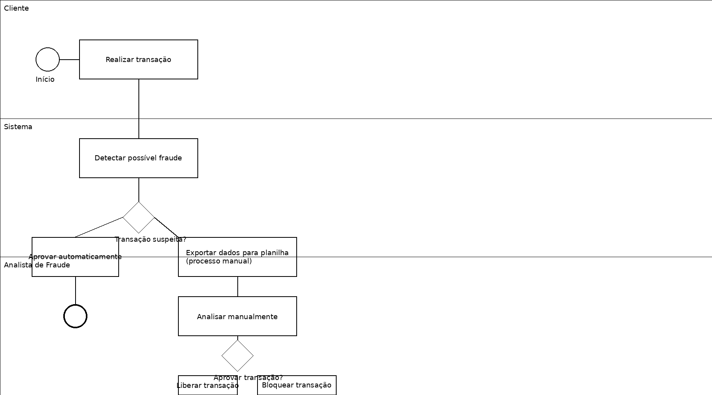
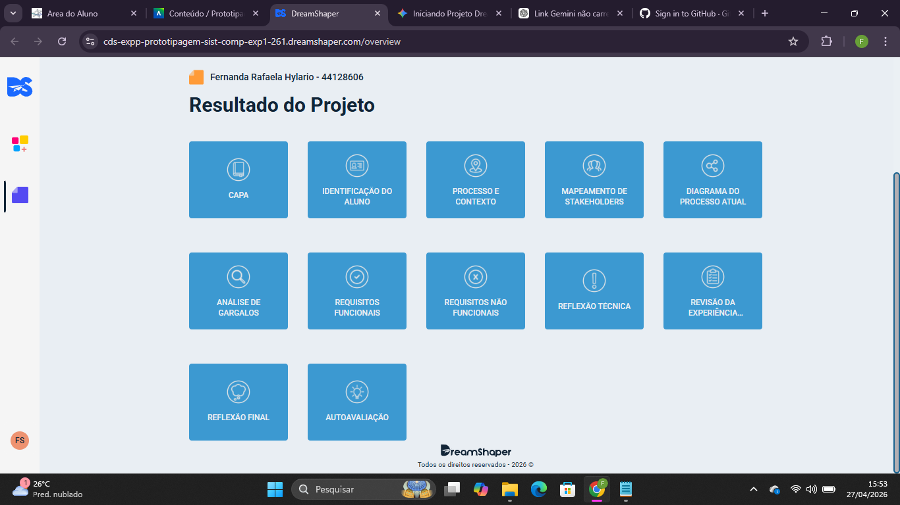

# 🔍 Análise de Processo de Prevenção à Fraude

> Projeto acadêmico aplicado com foco em análise de processos e proposta de solução tecnológica.

## 📌 Sobre o projeto
Este projeto simula um cenário real de prevenção à fraude, aplicando conceitos de análise de sistemas e melhoria de processos organizacionais.

O objetivo é analisar o fluxo atual de validação de transações suspeitas, identificar gargalos operacionais e propor uma solução tecnológica eficiente e escalável.

---

## 🚨 Problema
O processo atual apresenta diversas ineficiências, como:

- Uso de planilhas manuais  
- Falta de integração entre sistemas  
- Retrabalho frequente  
- Lentidão na análise de transações  
- Baixa rastreabilidade das decisões  

Esses fatores impactam diretamente a produtividade, aumentam custos operacionais e elevam o risco de falhas na detecção de fraudes.

---

## 📊 Metodologia utilizada

- Levantamento de requisitos  
- Modelagem de processos (BPMN 2.0)  
- Identificação de gargalos operacionais  
- Análise de impacto no negócio  

---

## 🗺️ BPMN (Processo Atual)

---

## ⚠️ Gargalos identificados

- Dependência de processos manuais  
- Uso de múltiplas ferramentas não integradas  
- Alto tempo de análise manual  
- Falta de padronização nas decisões  
- Risco de erro humano  

---

## 💡 Solução proposta

Implementação de um sistema integrado capaz de:

- Automatizar a análise de transações suspeitas  
- Centralizar informações em uma única plataforma  
- Reduzir erros operacionais  
- Melhorar a rastreabilidade e auditoria  
- Aumentar a eficiência operacional  

---

## 📈 Resultados esperados

- Redução do tempo de análise  
- Diminuição de retrabalho  
- Aumento da produtividade da equipe  
- Melhoria na segurança das decisões  
- Maior controle e rastreabilidade  

---

## 📸 Evidências

### Resultado do projeto

### Dashboard

---

## 🚀 Próximos passos

- Desenvolvimento de protótipo (Figma)  
- Implementação de sistema integrado  
- Automação com regras de fraude  
- Integração com APIs e bases de dados  

---

## 📌 Competências desenvolvidas

- Análise de processos organizacionais  
- Modelagem BPMN 2.0  
- Levantamento de requisitos  
- Pensamento analítico  
- Visão de negócio aplicada à tecnologia  

---

## 👩‍💻 Autora
Fernanda Rafaela Hylario
