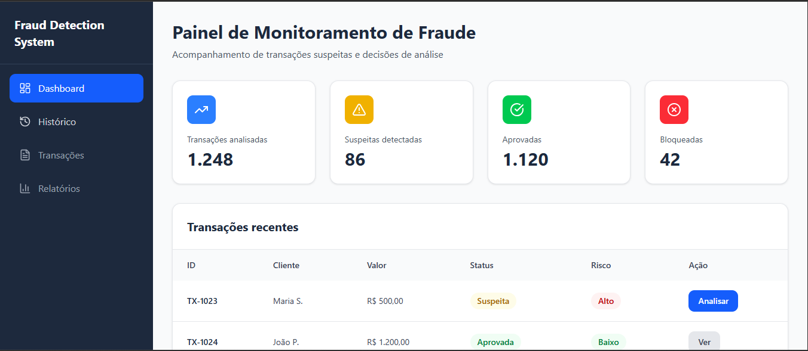
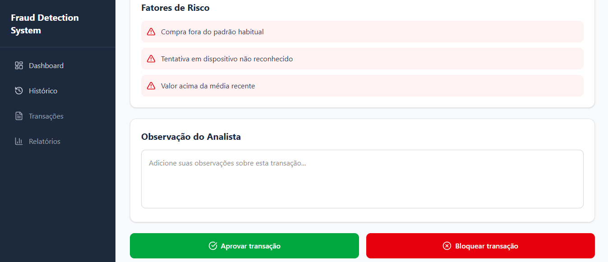

# 🔍 Análise de Processo de Prevenção à Fraude

Este projeto apresenta a análise e modelagem de um processo de validação de transações suspeitas, com foco na identificação de gargalos e proposta de solução tecnológica.

---

## 📌 Objetivo

Mapear o processo atual (AS-IS), identificar ineficiências e propor uma solução digital para otimizar a análise de fraude.

---

## 🧠 Etapas do Projeto

- Modelagem de processo utilizando BPMN 2.0  
- Identificação de gargalos e falhas operacionais  
- Levantamento de requisitos funcionais e não funcionais  
- Criação de protótipo interativo no Figma  

---

## 🖥️ Protótipo do Sistema

Protótipo navegável simulando um sistema real de análise de fraude.

👉 [Acesse o protótipo navegável aqui](https://www.figma.com/make/7GS5etnSHUo0aHDg2sGLi2/Fraud-Detection-Dashboard-Prototype?fullscreen=1&t=cf3Cb2VMuK9RRsUR-1&preview-route=%2Fhistory)

---

## 📸 Telas do Sistema

### Dashboard

### Análise de Transação

### Decisão do Analista

### Feedback do Sistema

### Histórico de Decisões

---

## 🚀 Tecnologias e Ferramentas

- BPMN 2.0  
- Figma (Protótipo interativo)  
- GitHub (versionamento)

---

## 💼 Sobre o Projeto

Este projeto simula a transformação de um processo manual em uma solução digital integrada, com foco em eficiência operacional, rastreabilidade e redução de riscos.

---

## 👩‍💻 Autora

Fernanda Hylario
